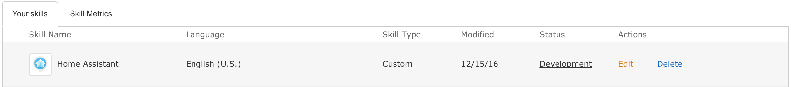
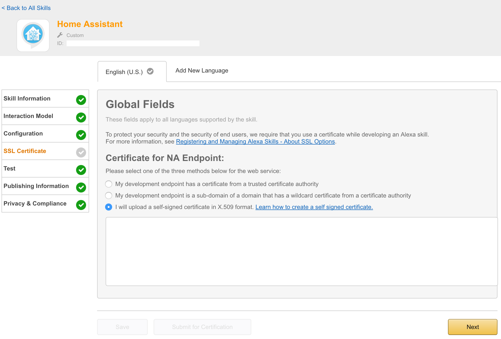

# Alexa API Setup

This is a walkthrough of setting up a skill on https://developer.amazon.com/edw/home.html#/skill/

The real work starts on the "Interaction Model" tab. 

###Intents
Intents are the things we use to link our utterances and our custom slots.

### For example:

**Intent Schema**:
```
{
  "intents": [
      {
      "intent": "ActivateIntent",
      "slots":[
        {
        	"name" : "Group",
          "type" : "Groups"
        }
      ]
      }
  ]
}
```

**Custom Slot Types**:  
Type: Groups  
Values:
```
living room
andrews room
```

**Sample Utterances**:
```
ActivateIntent turn on {Group}
ActivateIntent turn {Group} on
```

In the above intent, our intent name is **ActivateIntent**, the custom slot type is **Groups** and our custom slot value will be referenced as **Group**.

So what is a *custom slot*? A custom slot allows us to pass a different value to our Home Assistant setup. Essentially, this sets a variable that is passed to HASS, so that we can use one intent as as template to do more functions. 


So that finishes up the majority of the Alexa skill configuration, now let's look at the HASS Alexa YAML.

**alexa.yaml**:
```
intents:
  ActivateIntent:
    action:
      - service: homeassistant.turn_on
        data_template:
          entity_id: group.{{ Group | replace(" ", "_") }}
          #The replace(" ", "_") allows us to fix the space that Amazon passes to us
    speech:
      type: plaintext
      text: Turned on {{ Group }}
```

So this is actually pretty simple. We see that intent name, **ActivateIntent** is referenced, along with an **action** and a **speech** section. 

With this intent, we are turning on a group, passed to Home Assistant as {{ Group }} (using HASS Jinja2 templating language). This is essentially just an automation, but is triggered by Amazon's API. The **speech** section is what Alexa will speak back to us when the intent is activated. 

This might be a little confusing, so below I've pasted the call that Amazon's API actually makes to Home Assistant (this is from the "Service Simulator" section found in the "Test" section of the Alexa API skill setup).

Here is the Service Request displayed when entering "tell home assistant to turn on living room" as an utterenace (this is what you will speak to Alexa). We said "tell home assistant" because home assistant is what we set as our "Invocation Name" when setting up our skill on Amazon's site. 


```
...
...
...
  "request": {
    "type": "IntentRequest",
    "requestId": "EdwRequestId.7bb3b239-0e0e-4413-b365-2302d64f527a",
    "locale": "en-US",
    "timestamp": "2016-12-23T03:11:49Z",
    "intent": {
      "name": "ActivateIntent",
      "slots": {
        "Group": {
          "name": "Group",
          "value": "living room"
        }
      }
    }
  },
  "version": "1.0"
}
```

I've cut out some of the extraneous info above, but you can see that Amazon figured out we want to use *ActivateIntent* (because of the utterance) and it set the variable *Group* to the string "living room". 

In this case, Home Assistant responded with:

```
{
  "version": "1.0",
  "response": {
    "outputSpeech": {
      "type": "PlainText",
      "text": "Turned on living room"
    },
    "shouldEndSession": true
  },
  "sessionAttributes": {}
}
```

It worked :)


##Other Notes:

+ On the "Configuration" tab, I used `https://HASS_FQDN_OR_IP/api/alexa?api_password=API_PASSWORD`
+ I ended up having to paste my LetsEncrypt cert. I don't think Amazon recongnizes LE. You can use self-signed. 
+ You **HAVE** to use port 443. Amazon will not attempt to connect using HTTPS over an alternate port. (I would suggest a source-based NAT policy on your home firewall, I am allowing 72.21.217.0/24)
+ It might be worth your time to set up a template on the Home Assistant side of things. This way if Alexa hears incorrectly, or you try and do something she doesn't know, you can have her reply with a clever error message. For instance, in the intent above, I could have HASS check to see if group was anything other than living room or andrews room, and speak an error if so.
+ No need to publish the Alexa Skill. It will be active on your account only. 
+ Email me at andrew@aneis.ch if you have questions or concerns. 


##Advanced!!!

I have a more advanced intent that I bet you can figure out. 

**Intent Schema**:
```
{
  "intents": [
      {
      "intent": "WhatisMyRoomIntent",
      "slots":[
        {
        	"name" : "Thermometer",
          "type" : "Thermometers"
        }
      ]
      }
  ]
}
```

**Custom Slot Type**:  
Type: Thermometers  
Values:
```
room
```

**Sample Utterances**:
```
WhatisMyRoomIntent what my {Thermometer} temperature is
WhatisMyRoomIntent what temperature my {Thermometer} is
WhatisMyRoomIntent what the temperature of my {Thermometer} is
WhatisMyRoomIntent how cold is my {Thermometer}
WhatisMyRoomIntent how hot is my {Thermometer}
WhatisMyRoomIntent how cold my {Thermometer} is
WhatisMyRoomIntent how hot my {Thermometer} is
```

**alexa.yaml**:
```
  WhatisMyRoomIntent:
    speech:
        type: plaintext
        text: >
          
            
              The sensor hasn't reported a value, sorry!
            
              The sensor hasn't reported a value, sorry!
            
              Your room is {{ states.sensor.andrew_room_temperature_readout.state }} degrees
            
          
              I don't have a thermometer with that name
          
```


## Screenshots from https://developer.amazon.com/edw/home.html#/skills/list





