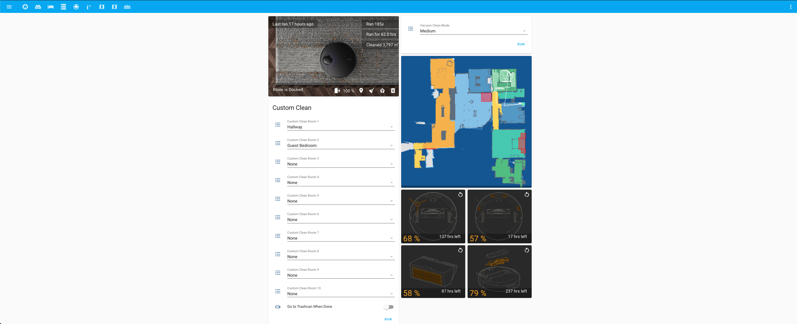
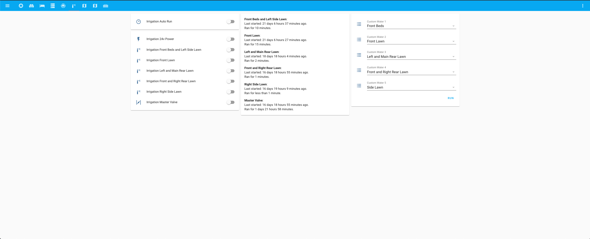

# My Home Assistant Config

[-brightgreen)](https://github.com/home-assistant/home-assistant/releases/latest)
 

I do my best to keep [Home Assistant](https://github.com/home-assistant/home-assistant) on the [latest release](https://github.com/home-assistant/home-assistant/releases/latest). I'm heavily utilizing [AppDaemon](http://appdaemon.readthedocs.io/en/latest/) and [NodeRed](https://flows.nodered.org/node/node-red-contrib-home-assistant-websocket) for advanced/templated automations. See [Appdaemon config](https://github.com/aneisch/home-assistant-config/tree/master/extras/appdaemon) and my NodeRed screenshots below for details. Using [Home Assistant Companion](https://itunes.apple.com/us/app/home-assistant-companion/id1099568401?mt=8) for iOS, built-in browser shortcut in Android. Also using [Tasker Plugin](https://github.com/MarkAdamson/home-assistant-plugin-for-tasker) from [MarkAdamsom](https://github.com/MarkAdamson) to trigger some automations and scripts from the client-side. Most of my home automation software pieces run as Docker containers (see [docker-compose for container list](https://github.com/aneisch/home-assistant-config/tree/master/extras/docker-compose)). 

My Home Assistant installation contains many different components and runs on a Gen7 i3 NUC running Centos 7:

- Owntracks for iOS and Android
- Lots of Docker containers, some described below. See [Docker Compose](https://github.com/aneisch/home-assistant-config/tree/master/extras/docker-compose)
- [Sonoff Switches](https://www.itead.cc/sonoff-wifi-wireless-switch.html) running [ESPHome](https://esphome.io/index.html)
- Orvibo Switches
- Radio Thermostat CT-50 (additional monitoring done through [docker container](https://hub.docker.com/r/aneisch/thermostat_mqtt_docker))
- Raspberry Pi hosted USB Camera (M-JPEG streamer)
- ESP32 Cameras running [ESPHome](https://esphome.io/)
- Numerous Wemos [D1 Mini](https://wiki.wemos.cc/products:d1:d1_mini) sensors via [ESPHome](https://esphome.io/components/api.html) (using ESPHome API, not MQTT). See [/extras/esphome](https://github.com/aneisch/home-assistant-config/tree/master/extras/esphome) for configs. 
- Milights with [Homebrew MiLight controller](http://blog.christophermullins.com/2017/02/11/milight-wifi-gateway-emulator-on-an-esp8266/) using D1 Mini and NRF24L01. 
- Wemo wall plugs
- Aeon Labs ZW090 Z Stick
- Aeon Labs DSA03202 v1 - z-wave Minimote
- GE Z-wave in-wall switch/fan controllers
- ZHA using CC2531 with zigbee2mqtt firmware
- [Lustreon E27](https://www.banggood.com/LUSTREON-E27-Smart-WiFi-Bulb-Adapter-Socket-Lamp-Holder-Work-With-Alexa-Google-Home-IFTTT-AC85-265V-p-1285550.html) bulb holders for lamp control using ~~Tasmota/MQTT~~ ESPHome (1MB flash)
  - Check out [my blog post](http://blog.aneis.ch/2019/01/tuya-convert-for-lustreon.html) for alternative firmware flashing instructions
- Various z-wave sensors
- MQTT remote and local server (via [Docker](https://github.com/aneisch/home-assistant-config/tree/master/extras/docker-compose)). Using remote with SSL for Owntracks (on a box through Digital Ocean with static public IP), and local MQTT to communicate with various sensors/switches around the house. The remote MQTT shares messages with the local via a MQTT bridge.
- Various MQTT Sensors (some in [extras/scripts](https://github.com/aneisch/home-assistant-config/tree/master/extras/scripts))
- Arlo Cameras (controlled through [aarlo custom component](https://github.com/twrecked/hass-aarlo))
- [AppDaemon](https://appdaemon.readthedocs.io/en/latest/) controlling a handful of automations and intelligent AC control. See [/extras/appdaemon](https://github.com/aneisch/home-assistant-config/tree/master/extras/appdaemon) for configs.
- [NodeRed](https://flows.nodered.org/node/node-red-contrib-home-assistant-websocket) for a few others (see screenshot below)
- Amazon Echos
  - [Amazon Alexa Smart Home API](https://www.home-assistant.io/components/alexa.smart_home/) using AWS Lambda 
  - Custom routines configured in the Alexa App.
  - [Alexa Media Player Custom Component](https://github.com/keatontaylor/alexa_media_player)
- UPS monitoring using [apcupsd](https://github.com/gersilex/apcupsd-docker)
- Github actions to test beta and stable builds against config.

Also using Grafana/Influx for graphing, both running in Docker containers on Intel NUC, see [docker-compose](https://github.com/aneisch/home-assistant-config/tree/master/extras/docker-compose) for container list. Home Assistant, along with a few other web apps, are proxied through my firewall and fronted and secured by Cloudflare.
 

## Some statistics about my installation:
Description | value
-- | --
Lines of ESPHome YAML | 990
Lines of Home Assistant YAML | 3121
[Integrations](https://www.home-assistant.io/integrations/) in use | 17
Zigbee devices in [`zha`](https://www.home-assistant.io/integrations/zha/) | 5
 
Description | value
-- | --
Entities in the [`alarm_control_panel`](https://www.home-assistant.io/components/alarm_control_panel) domain | 3
Entities in the [`automation`](https://www.home-assistant.io/components/automation) domain | 30
Entities in the [`binary_sensor`](https://www.home-assistant.io/components/binary_sensor) domain | 16
Entities in the [`camera`](https://www.home-assistant.io/components/camera) domain | 12
Entities in the [`climate`](https://www.home-assistant.io/components/climate) domain | 1
Entities in the [`device_tracker`](https://www.home-assistant.io/components/device_tracker) domain | 10
Entities in the [`fan`](https://www.home-assistant.io/components/fan) domain | 4
Entities in the [`group`](https://www.home-assistant.io/components/group) domain | 10
Entities in the [`input_boolean`](https://www.home-assistant.io/components/input_boolean) domain | 10
Entities in the [`input_datetime`](https://www.home-assistant.io/components/input_datetime) domain | 5
Entities in the [`input_number`](https://www.home-assistant.io/components/input_number) domain | 4
Entities in the [`input_select`](https://www.home-assistant.io/components/input_select) domain | 1
Entities in the [`light`](https://www.home-assistant.io/components/light) domain | 10
Entities in the [`media_player`](https://www.home-assistant.io/components/media_player) domain | 8
Entities in the [`person`](https://www.home-assistant.io/components/person) domain | 2
Entities in the [`plant`](https://www.home-assistant.io/components/plant) domain | 1
Entities in the [`scene`](https://www.home-assistant.io/components/scene) domain | 6
Entities in the [`script`](https://www.home-assistant.io/components/script) domain | 17
Entities in the [`sensor`](https://www.home-assistant.io/components/sensor) domain | 211
Entities in the [`sun`](https://www.home-assistant.io/components/sun) domain | 1
Entities in the [`switch`](https://www.home-assistant.io/components/switch) domain | 74
Entities in the [`weather`](https://www.home-assistant.io/components/weather) domain | 1
Entities in the [`zone`](https://www.home-assistant.io/components/zone) domain | 7
Entities in the [`zwave`](https://www.home-assistant.io/components/zwave) domain | 11
**Total state objects** | **455**
## The HACS integrations/plugins that I use:
**Appdaemon**: 
[aneisch/follow_me_appdaemon](https://github.com/aneisch/follow_me_appdaemon) 

**Theme**: 
[JuanMTech/google_dark_theme](https://github.com/JuanMTech/google_dark_theme) 
[aFFekopp/dark_teal](https://github.com/aFFekopp/dark_teal) 
[home-assistant-community-themes/amoled](https://github.com/home-assistant-community-themes/amoled) 
[home-assistant-community-themes/aqua-fiesta](https://github.com/home-assistant-community-themes/aqua-fiesta) 
[home-assistant-community-themes/blue-night](https://github.com/home-assistant-community-themes/blue-night) 
[home-assistant-community-themes/dark-mint](https://github.com/home-assistant-community-themes/dark-mint) 
[home-assistant-community-themes/grey-night](https://github.com/home-assistant-community-themes/grey-night) 
[naofireblade/clear-theme-dark](https://github.com/naofireblade/clear-theme-dark) 
[seangreen2/slate_theme](https://github.com/seangreen2/slate_theme) 

**Integration**: 
[custom-components/alexa_media_player](https://github.com/custom-components/alexa_media_player) 
[custom-components/readme](https://github.com/custom-components/readme) 
[hacs/integration](https://github.com/hacs/integration) 
[moralmunky/Home-Assistant-Mail-And-Packages](https://github.com/moralmunky/Home-Assistant-Mail-And-Packages) 
[twrecked/hass-aarlo](https://github.com/twrecked/hass-aarlo) 

**Plugin**: 
[bramkragten/weather-card](https://github.com/bramkragten/weather-card) 
[custom-cards/bar-card](https://github.com/custom-cards/bar-card) 
[custom-cards/bignumber-card](https://github.com/custom-cards/bignumber-card) 
[custom-cards/button-card](https://github.com/custom-cards/button-card) 
[custom-cards/favicon-counter](https://github.com/custom-cards/favicon-counter) 
[gadgetchnnel/lovelace-card-preloader](https://github.com/gadgetchnnel/lovelace-card-preloader) 
[iantrich/config-template-card](https://github.com/iantrich/config-template-card) 
[kalkih/mini-media-player](https://github.com/kalkih/mini-media-player) 
[maykar/custom-header](https://github.com/maykar/custom-header) 
[maykar/lovelace-swipe-navigation](https://github.com/maykar/lovelace-swipe-navigation) 
[nervetattoo/simple-thermostat](https://github.com/nervetattoo/simple-thermostat) 
[ofekashery/vertical-stack-in-card](https://github.com/ofekashery/vertical-stack-in-card) 
[thomasloven/lovelace-card-mod](https://github.com/thomasloven/lovelace-card-mod) 
[thomasloven/lovelace-slider-entity-row](https://github.com/thomasloven/lovelace-slider-entity-row) 
[thomasloven/lovelace-toggle-lock-entity-row](https://github.com/thomasloven/lovelace-toggle-lock-entity-row) 
[twrecked/lovelace-hass-aarlo](https://github.com/twrecked/lovelace-hass-aarlo) 

# Interface
  
  

Auto generated using: `docker run --rm -it --cap-add=SYS_ADMIN -v /tmp:/output tonious/chromeshot --delay=1000 --url=http://10.0.1.22:1880 --viewportWidth=2000 --viewportHeight=1800 --output=/output/nodered.png; sudo convert /tmp/nodered.png -crop 1350x1400+180+10 /tmp/ss.png`
