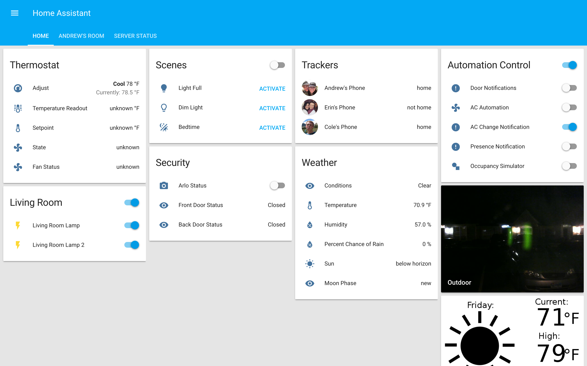
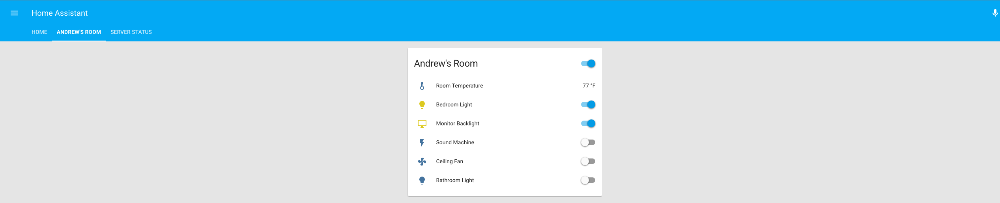
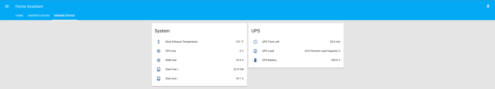

# home-assistant

My home assitant config. 

My tasker configuration is also included. I am using tasker to trigger scenes based on location mostly but to also act as a quick toggle for scenes. I am using mqtt to trigger the scenes, as opposed to the API because tasker did not have a way to pass api credentials.. Feel free to download and import the tasker config, although you will have to change some variables such as your home location, mqtt username, mqtt password, and mqtt address. You will also need to install 'Auto Alarm' and the Tasker mqtt plugin.

https://play.google.com/store/apps/details?id=net.nosybore.mqttpublishplugin&hl=en
https://play.google.com/store/apps/details?id=com.joaomgcd.autoalarm&hl=en

My home automation suite is built out of many different components and runs on a Raspberry Pi Model B with Debian Jessie OS:

- Sonoff Switches (https://www.itead.cc/sonoff-wifi-wireless-switch.html)
  - With custom firmware (https://github.com/arendst/Sonoff-MQTT-OTA-Arduino)
- Orvibo Switches
- Radio Thermostat CT-50 (monitoring done through bash script calling API and publishing to MQTT)
- Raspberry Pi hosted USB Camera (M-JPEG streamer)
- Milights with wifi bridge (bulb and 5050 LED controller)
- Digistump Oaks running as MQTT-publishing thermometers
- D1 Mini Arduino dev boards with DHT Sensors and other shields publishing to MQTT
- Various MQTT Sensors (eg: moon status, determined using bash and published to MQTT))
- Arlo Cameras (controlled through IFTTT)

~~I'm using InfluxDB and Grafana to store and display metrics.
Big thanks to Oliver van Porten for the setup guide. https://www.van-porten.de/blog/2016/03/home-assistant/ (See "Influx DB and Grafana section"
Also used instructions from http://docs.grafana.org/datasources/influxdb/ to set up my data source.~~
Grafana/Influx bogged down my pi, I might revisit this later...

 

# Interface
  
  

