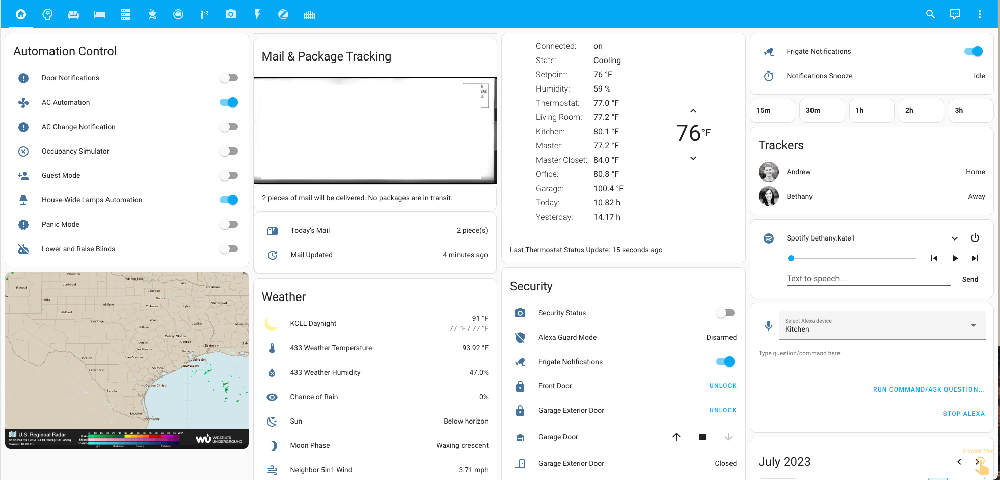
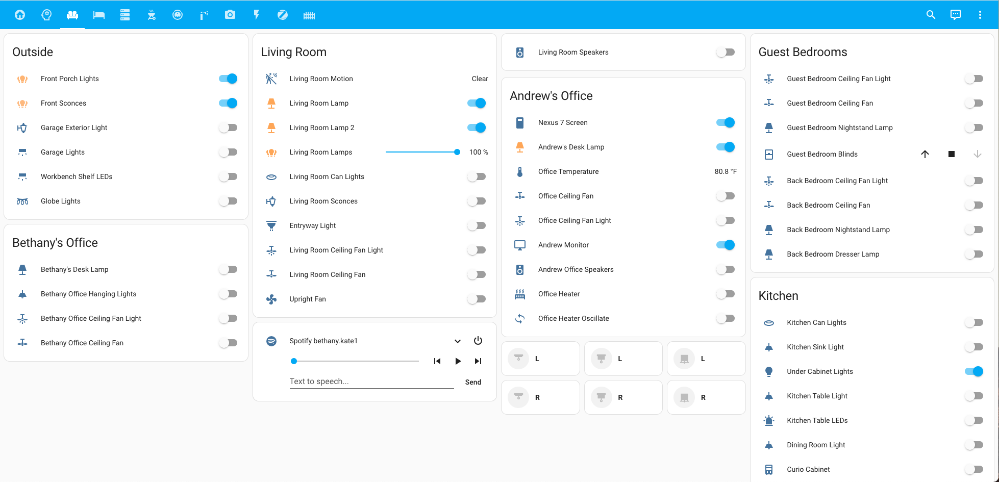
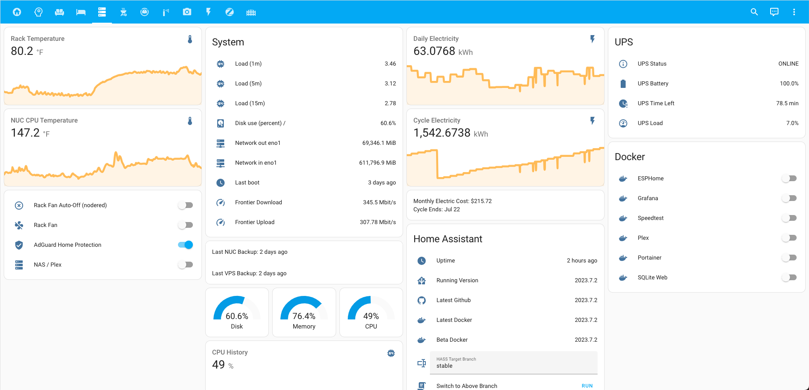
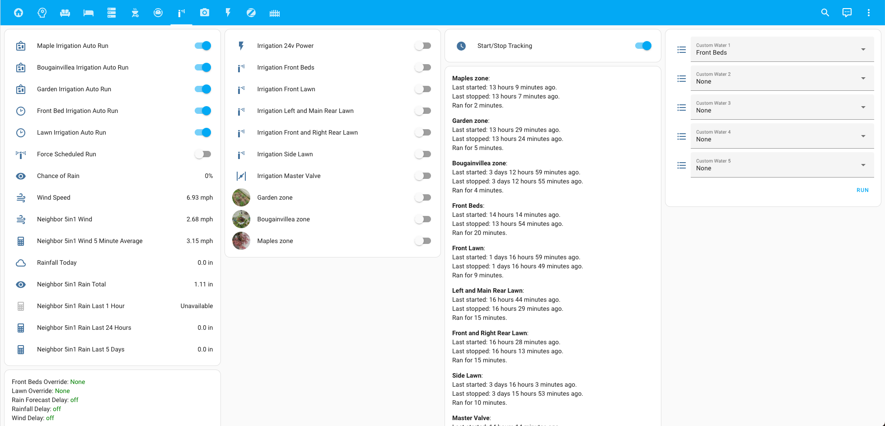
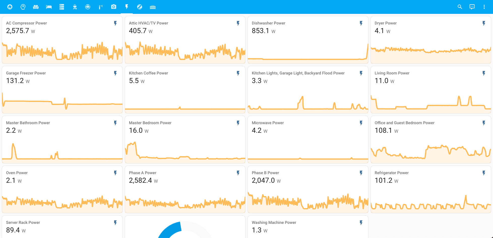

# My Home Assistant Config

[-brightgreen)](https://github.com/home-assistant/home-assistant/releases/latest)
 

I do my best to keep [Home Assistant](https://github.com/home-assistant/home-assistant) on the [latest release](https://github.com/home-assistant/home-assistant/releases/latest). I'm heavily utilizing [AppDaemon](http://appdaemon.readthedocs.io/en/latest/) and [NodeRed](https://flows.nodered.org/node/node-red-contrib-home-assistant-websocket) for advanced/templated automations. See [Appdaemon config](https://github.com/aneisch/home-assistant-config/tree/master/extras/appdaemon) and my NodeRed screenshots below for details. Using [Home Assistant Companion](https://itunes.apple.com/us/app/home-assistant-companion/id1099568401?mt=8) for iOS, built-in browser shortcut in Android. Also using [Tasker Plugin](https://github.com/MarkAdamson/home-assistant-plugin-for-tasker) from [MarkAdamsom](https://github.com/MarkAdamson) to trigger some automations and scripts from the client-side. Most of my home automation software pieces run as Docker containers (see [docker-compose for container list](https://github.com/aneisch/home-assistant-config/tree/master/extras/docker-compose)). 

My Home Assistant installation contains many different components and runs on a [Gen7 i3 NUC](https://amzn.to/2K0vab6) running Centos 7:

- Home Assistant Companion for iOS and Android device tracking
- Lots of Docker containers, some described below. See [Docker Compose](https://github.com/aneisch/home-assistant-config/tree/master/extras/docker-compose)
- [Frigate](https://frigate.video/) for security camera recording and object detection
- A plethora of Lolin D1 Mini and S2 Mini sensors via [ESPHome](https://esphome.io/components/api.html) (using ESPHome API, not MQTT). See [/extras/esphome](https://github.com/aneisch/home-assistant-config/tree/master/extras/esphome) for configs. 
- Milights with [Homebrew MiLight controller](http://blog.christophermullins.com/2017/02/11/milight-wifi-gateway-emulator-on-an-esp8266/) using D1 Mini and NRF24L01. 
- Zwave, Zigbee, and Wifi (ESPHome) smart plugs
- ZHA using [CC2531](https://amzn.to/2L5xKNB) running zigbee2mqtt firmware
- Z-Wave JS using Aeon Labs USB stick with:
  - 1 AEON Labs DSA03XXX-ZW
  - 1 AEON Labs ZW090
  - 2 First Alert (BRK Brands Inc) ZCOMBO
  - 1 GE 12719 / ZW4101
  - 2 GE 12720 / ZW4201
  - 1 GE 12722 / ZW4005
  - 2 GE 12730 / ZW4002
  - 1 Kwikset 910
  - 1 Leviton DZPA1
  - 1 Nortek Security + Control LLC WADWAZ-1
  - 1 Nortek Security + Control LLC WAPIRZ-1
  - 1 Zooz ZAC36
  - 5 Zooz ZEN21
  - 6 Zooz ZEN27
  - 6 Zooz ZEN30
  - 2 Zooz ZEN71
  - 1 Zooz ZEN77
  - 5 Zooz ZSE42
- MQTT remote and local server (via [Docker](https://github.com/aneisch/home-assistant-config/tree/master/extras/docker-compose))
- Various MQTT Sensors (some in [extras/scripts](https://github.com/aneisch/home-assistant-config/tree/master/extras/scripts))
- RTL_433 to capture data from various off-the-shelf sensors
- [AppDaemon](https://appdaemon.readthedocs.io/en/latest/) controlling a large number of automations and intelligent AC control. See [/extras/appdaemon](https://github.com/aneisch/home-assistant-config/tree/master/extras/appdaemon) for configs.
- [NodeRed](https://flows.nodered.org/node/node-red-contrib-home-assistant-websocket) for irrigation and other automations (see screenshot below)
- [Amazon Echos](https://amzn.to/2VLPPm0)
  - [Amazon Alexa Smart Home API](https://www.home-assistant.io/components/alexa.smart_home/) using AWS Lambda 
  - Custom routines configured in the Alexa App.
  - [Alexa Media Player Custom Component](https://github.com/keatontaylor/alexa_media_player)
- UPS monitoring using [apcupsd](https://github.com/gersilex/apcupsd-docker)
- Home power monitoring with ESPHome-flashed Emporia View
- Github actions to test beta and stable builds against config

Also using Grafana/Influx for graphing, both running in Docker containers on NUC, see [docker-compose](https://github.com/aneisch/home-assistant-config/tree/master/extras/docker-compose) for container list. Home Assistant, along with a few other web apps, are proxied through my firewall and fronted and secured by Cloudflare.
 

## Some statistics about my installation:
Description | value
-- | --
Lines of ESPHome YAML | 2420
Lines of Home Assistant YAML | 7712
[Integrations](https://www.home-assistant.io/integrations/) in use | 48
Zigbee devices in [`zha`](https://www.home-assistant.io/integrations/zha/) | 26
Z-Wave devices in [`zwave_js`](https://www.home-assistant.io/integrations/zwave_js/) | 37
 
Description | value
-- | --
Entities in the [`alarm_control_panel`](https://www.home-assistant.io/components/alarm_control_panel) domain | 1
Entities in the [`automation`](https://www.home-assistant.io/components/automation) domain | 97
Entities in the [`binary_sensor`](https://www.home-assistant.io/components/binary_sensor) domain | 116
Entities in the [`button`](https://www.home-assistant.io/components/button) domain | 8
Entities in the [`calendar`](https://www.home-assistant.io/components/calendar) domain | 1
Entities in the [`camera`](https://www.home-assistant.io/components/camera) domain | 18
Entities in the [`climate`](https://www.home-assistant.io/components/climate) domain | 1
Entities in the [`counter`](https://www.home-assistant.io/components/counter) domain | 1
Entities in the [`cover`](https://www.home-assistant.io/components/cover) domain | 8
Entities in the [`device_tracker`](https://www.home-assistant.io/components/device_tracker) domain | 4
Entities in the [`fan`](https://www.home-assistant.io/components/fan) domain | 3
Entities in the [`group`](https://www.home-assistant.io/components/group) domain | 14
Entities in the [`input_boolean`](https://www.home-assistant.io/components/input_boolean) domain | 26
Entities in the [`input_datetime`](https://www.home-assistant.io/components/input_datetime) domain | 33
Entities in the [`input_number`](https://www.home-assistant.io/components/input_number) domain | 4
Entities in the [`input_select`](https://www.home-assistant.io/components/input_select) domain | 19
Entities in the [`input_text`](https://www.home-assistant.io/components/input_text) domain | 5
Entities in the [`light`](https://www.home-assistant.io/components/light) domain | 37
Entities in the [`lock`](https://www.home-assistant.io/components/lock) domain | 2
Entities in the [`media_player`](https://www.home-assistant.io/components/media_player) domain | 11
Entities in the [`number`](https://www.home-assistant.io/components/number) domain | 4
Entities in the [`person`](https://www.home-assistant.io/components/person) domain | 2
Entities in the [`plant`](https://www.home-assistant.io/components/plant) domain | 1
Entities in the [`remote`](https://www.home-assistant.io/components/remote) domain | 1
Entities in the [`scene`](https://www.home-assistant.io/components/scene) domain | 2
Entities in the [`script`](https://www.home-assistant.io/components/script) domain | 38
Entities in the [`select`](https://www.home-assistant.io/components/select) domain | 1
Entities in the [`sensor`](https://www.home-assistant.io/components/sensor) domain | 361
Entities in the [`siren`](https://www.home-assistant.io/components/siren) domain | 1
Entities in the [`sun`](https://www.home-assistant.io/components/sun) domain | 1
Entities in the [`switch`](https://www.home-assistant.io/components/switch) domain | 144
Entities in the [`timer`](https://www.home-assistant.io/components/timer) domain | 2
Entities in the [`update`](https://www.home-assistant.io/components/update) domain | 1
Entities in the [`vacuum`](https://www.home-assistant.io/components/vacuum) domain | 1
Entities in the [`weather`](https://www.home-assistant.io/components/weather) domain | 2
Entities in the [`zone`](https://www.home-assistant.io/components/zone) domain | 6
**Total state objects** | **977**
## The HACS integrations/plugins that I use:
**Appdaemon**: 
[aneisch/follow_me_appdaemon](https://github.com/aneisch/follow_me_appdaemon) 

**Theme**: 
[JuanMTech/google_dark_theme](https://github.com/JuanMTech/google_dark_theme) 
[aFFekopp/dark_teal](https://github.com/aFFekopp/dark_teal) 
[home-assistant-community-themes/amoled](https://github.com/home-assistant-community-themes/amoled) 
[home-assistant-community-themes/aqua-fiesta](https://github.com/home-assistant-community-themes/aqua-fiesta) 
[home-assistant-community-themes/blue-night](https://github.com/home-assistant-community-themes/blue-night) 
[home-assistant-community-themes/dark-mint](https://github.com/home-assistant-community-themes/dark-mint) 
[home-assistant-community-themes/grey-night](https://github.com/home-assistant-community-themes/grey-night) 
[naofireblade/clear-theme-dark](https://github.com/naofireblade/clear-theme-dark) 
[seangreen2/slate_theme](https://github.com/seangreen2/slate_theme) 

**Integration**: 
[AlexxIT/SonoffLAN](https://github.com/AlexxIT/SonoffLAN) 
[PiotrMachowski/Home-Assistant-custom-components-Xiaomi-Cloud-Map-Extractor](https://github.com/PiotrMachowski/Home-Assistant-custom-components-Xiaomi-Cloud-Map-Extractor) 
[blakeblackshear/frigate-hass-integration](https://github.com/blakeblackshear/frigate-hass-integration) 
[bruxy70/Garbage-Collection](https://github.com/bruxy70/Garbage-Collection) 
[claytonjn/hass-circadian_lighting](https://github.com/claytonjn/hass-circadian_lighting) 
[custom-components/alexa_media_player](https://github.com/custom-components/alexa_media_player) 
[custom-components/readme](https://github.com/custom-components/readme) 
[dlashua/hass-setter](https://github.com/dlashua/hass-setter) 
[hacs/integration](https://github.com/hacs/integration) 
[moralmunky/Home-Assistant-Mail-And-Packages](https://github.com/moralmunky/Home-Assistant-Mail-And-Packages) 
[rospogrigio/localtuya](https://github.com/rospogrigio/localtuya) 
[rroller/dahua](https://github.com/rroller/dahua) 
[sebr/bhyve-home-assistant](https://github.com/sebr/bhyve-home-assistant) 
[ualex73/monitor_docker](https://github.com/ualex73/monitor_docker) 

**Plugin**: 
[PiotrMachowski/lovelace-xiaomi-vacuum-map-card](https://github.com/PiotrMachowski/lovelace-xiaomi-vacuum-map-card) 
[bramkragten/weather-card](https://github.com/bramkragten/weather-card) 
[custom-cards/bignumber-card](https://github.com/custom-cards/bignumber-card) 
[dermotduffy/frigate-hass-card](https://github.com/dermotduffy/frigate-hass-card) 
[dmulcahey/zha-network-visualization-card](https://github.com/dmulcahey/zha-network-visualization-card) 
[dylandoamaral/uptime-card](https://github.com/dylandoamaral/uptime-card) 
[gadgetchnnel/lovelace-card-templater](https://github.com/gadgetchnnel/lovelace-card-templater) 
[gadgetchnnel/lovelace-text-input-row](https://github.com/gadgetchnnel/lovelace-text-input-row) 
[htmltiger/numberbox-card](https://github.com/htmltiger/numberbox-card) 
[j-a-n/lovelace-wallpanel](https://github.com/j-a-n/lovelace-wallpanel) 
[kalkih/mini-media-player](https://github.com/kalkih/mini-media-player) 
[nervetattoo/simple-thermostat](https://github.com/nervetattoo/simple-thermostat) 
[ofekashery/vertical-stack-in-card](https://github.com/ofekashery/vertical-stack-in-card) 
[piitaya/lovelace-mushroom](https://github.com/piitaya/lovelace-mushroom) 
[pmongloid/flipdown-timer-card](https://github.com/pmongloid/flipdown-timer-card) 
[thomasloven/lovelace-auto-entities](https://github.com/thomasloven/lovelace-auto-entities) 
[thomasloven/lovelace-card-mod](https://github.com/thomasloven/lovelace-card-mod) 
[thomasloven/lovelace-card-tools](https://github.com/thomasloven/lovelace-card-tools) 
[thomasloven/lovelace-fold-entity-row](https://github.com/thomasloven/lovelace-fold-entity-row) 
[thomasloven/lovelace-slider-entity-row](https://github.com/thomasloven/lovelace-slider-entity-row) 

# Interface
  
  

Auto generated using: `docker run -it -v /tmp:/usr/src/app/out --rm nevermendel/chrome-headless-screenshots --width=$viewportWidth1 --height=$viewportHeight1 --filename=nodered_1 --delay=3000 http://10.0.1.22:1880/#flow/9584418c.dafc2`
