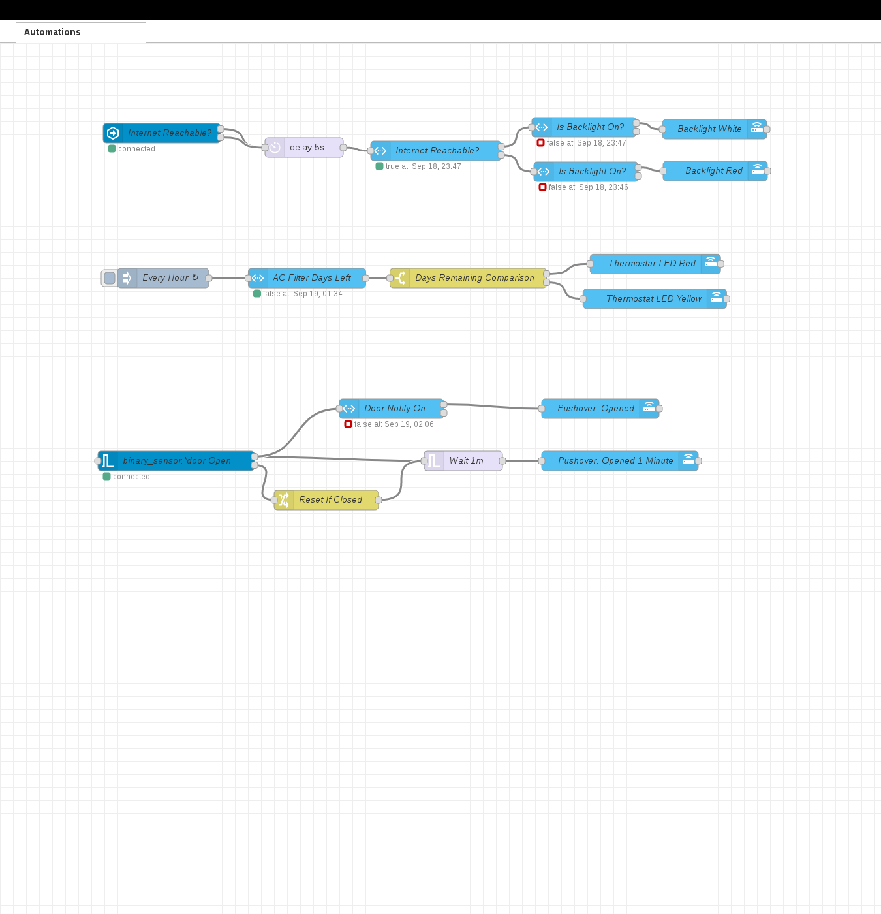

# My Home Assistant Config

[-brightgreen)](https://github.com/home-assistant/home-assistant/releases/latest)
 

I do my best to keep Home Assistant on the latest release. I'm heavily utilizing [AppDaemon](http://appdaemon.readthedocs.io/en/latest/) for advanced/templated automations. See [Appdaemon config](https://github.com/aneisch/home-assistant-config/tree/master/extras/appdaemon) for details. Using [Home Assistant Companion](https://itunes.apple.com/us/app/home-assistant-companion/id1099568401?mt=8) for iOS, built-in browser shortcut in Android. Also using [Tasker Plugin](https://github.com/MarkAdamson/home-assistant-plugin-for-tasker) from [MarkAdamsom](https://github.com/MarkAdamson) to trigger some automations and scripts from the client-side. All of my home automation software runs as docker containers (see [docker-compose config](https://github.com/aneisch/home-assistant-config/tree/master/extras/docker-compose)) with the exception of a few helper scritps. 

My Home Assistant installation contains many different components and runs on a Gen7 i3 NUC running Centos 7:

- Owntracks for iOS and Android
- [Sonoff Switches](https://www.itead.cc/sonoff-wifi-wireless-switch.html) running [ESPHome](https://esphome.io/index.html)
- Orvibo Switches
- Radio Thermostat CT-50 (additional monitoring done through [docker container](https://hub.docker.com/r/aneisch/thermostat_mqtt_docker))
- Raspberry Pi hosted USB Camera (M-JPEG streamer)
- ESP32 Cameras running ESPHome
- Milights with [Homebrew MiLight controller](http://blog.christophermullins.com/2017/02/11/milight-wifi-gateway-emulator-on-an-esp8266/) using D1 Mini and NRF24L01. 
- Wemo wall plugs
- Aeon Labs ZW090 Z Stick
- Aeon Labs DSA03202 v1 - z-wave Minimote
- GE Z-wave in-wall switch/fan controllers
- [Lustreon E27](https://www.banggood.com/LUSTREON-E27-Smart-WiFi-Bulb-Adapter-Socket-Lamp-Holder-Work-With-Alexa-Google-Home-IFTTT-AC85-265V-p-1285550.html) bulb holders for lamp control using ~~Tasmota/MQTT~~ ESPHome (1MB flash)
  - Check out [my blog post](http://blog.aneis.ch/2019/01/tuya-convert-for-lustreon.html) for alternative firmware flashing instructions
- Various z-wave sensors
- Various MQTT Sensors (eg: [moon status](https://github.com/aneisch/home-assistant-config/blob/master/extras/helper_scripts/moon_phase_mqtt), determined using bash and published to MQTT))
- Arlo Cameras (controlled through [aarlo custom component](https://github.com/twrecked/hass-aarlo))
- [AppDaemon](https://appdaemon.readthedocs.io/en/latest/) controlling a majority of automations. See [/extras/appdaemon](https://github.com/aneisch/home-assistant-config/tree/master/extras/appdaemon) for configs.
- Amazon Echo Dots
  - [Amazon Alexa Smart Home API](https://www.home-assistant.io/components/alexa.smart_home/) using AWS Lambda 
  - Custom routines configured in the Alexa App.
  - [Alexa Media Player Custom Component](https://github.com/keatontaylor/alexa_media_player)
- MQTT remote and local server (via [Docker](https://github.com/aneisch/home-assistant-config/tree/master/extras/docker-compose)). Using remote with SSL for Owntracks (on a box through Digital Ocean with static public IP), and local MQTT to communicate with various sensors/switches around the house. The remote MQTT shares messages with the local via a MQTT bridge.
- Numerous Wemos D1 Mini sensors via [ESPHome API](https://esphome.io/components/api.html). See [/extras/esphome](https://github.com/aneisch/home-assistant-config/tree/master/extras/esphome) for configs. 
- UPS monitoring using [pwrstat_docker](https://github.com/DanielWinks/pwrstat_docker)

Also using Grafana/Influx for graphing, both running in Docker containers on my NUC. Home Assistant, along with a few other web apps, are proxied through my firewall and served via Cloudflare.
 
Thanks to Deviant Engineer for the [guides](https://deviant.engineer/2016/11/hass-centos7/) that helped me during installation!!

## Some statistics about my installation:
Description | value
-- | --
Lines of YAML configuration | 2566
Number of entities (total) | 398  
Number of fans | 2  
Number of switches | 65  
Number of lights | 9  
Number of cameras | 11  
Number of sensors | 185  
Number of binary_sensors | 13  
Number of device_trackers | 8  
Number of media_players | 7  
Number of automations | 24  
Number of groups | 18  
Number of scenes | 5  
Number of scripts | 5  
Number of input_boolean | 9  
Number of input_select | 2  
Number of zones | 7  

## The HACS integrations/plugins that I use:
[bramkragten/swipe-card](https://github.com/bramkragten/swipe-card)  
[bramkragten/weather-card](https://github.com/bramkragten/weather-card)  
[custom-cards/bignumber-card](https://github.com/custom-cards/bignumber-card)  
[custom-cards/button-card](https://github.com/custom-cards/button-card)  
[custom-components/alexa_media_player](https://github.com/custom-components/alexa_media_player)  
[custom-components/readme](https://github.com/custom-components/readme)  
[hacs/integration](https://github.com/hacs/integration)  
[kalkih/mini-media-player](https://github.com/kalkih/mini-media-player)  
[maykar/compact-custom-header](https://github.com/maykar/compact-custom-header)  
[thomasloven/lovelace-gui-sandbox](https://github.com/thomasloven/lovelace-gui-sandbox)  
[thomasloven/lovelace-slider-entity-row](https://github.com/thomasloven/lovelace-slider-entity-row)  
[thomasloven/lovelace-toggle-lock-entity-row](https://github.com/thomasloven/lovelace-toggle-lock-entity-row)  
[twrecked/hass-aarlo](https://github.com/twrecked/hass-aarlo)  
[twrecked/lovelace-hass-aarlo](https://github.com/twrecked/lovelace-hass-aarlo)  

# Interface
  
  

Auto generated using: `docker run --rm -it --cap-add=SYS_ADMIN -v /tmp:/output tonious/chromeshot --delay=1000 --url=http://10.0.1.22:1880 --viewportWidth=2000 --viewportHeight=1800 --output=/output/nodered.png; sudo convert /tmp/nodered.png -crop 1350x1400+180+10 /tmp/ss.png`
