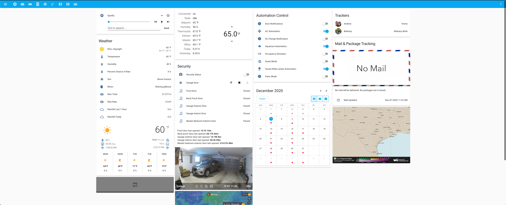
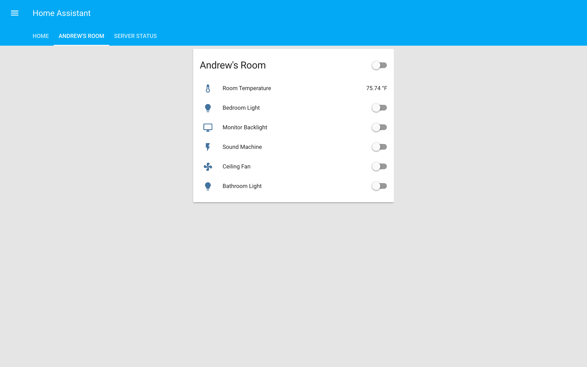
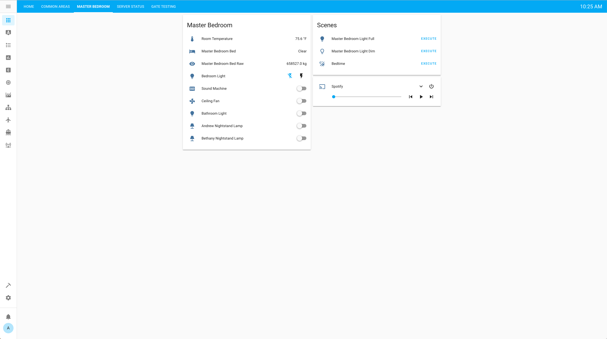
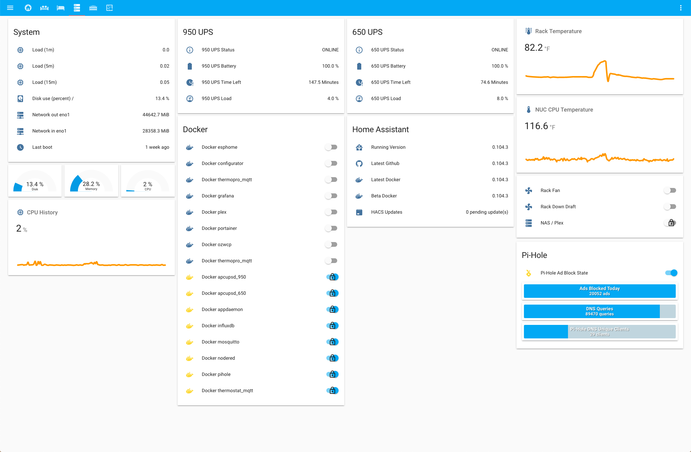
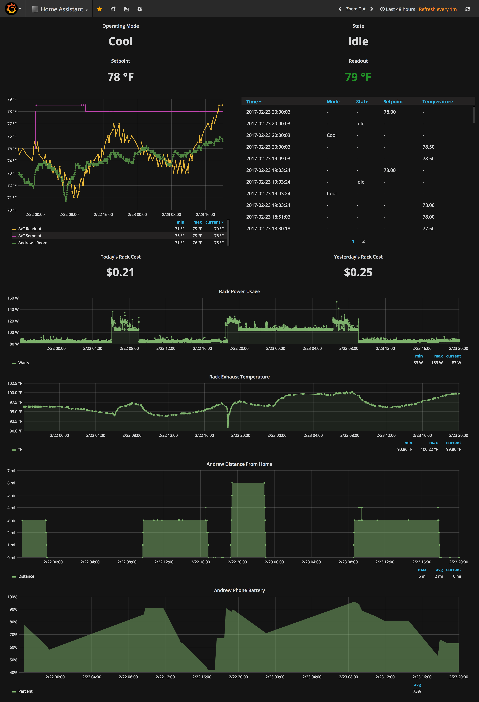

#  My Home Assistant Config

I am using tasker directly with API calls to Home Assistant in order to trigger scenes based on location mostly and also act as a quick toggle for devices/scenes.

Also heavily utilizing [AppDaemon](http://appdaemon.readthedocs.io/en/latest/) for advanced automations/dashboard. See [Appdaemon config](https://github.com/aneisch/home-assistant-config/tree/master/extras/appdaemon) for more. 

My Home Assistant installtion contains many different components and runs on a Gen7 i3 NUC running Centos 7:

- Sonoff Switches (https://www.itead.cc/sonoff-wifi-wireless-switch.html)
  - With custom firmware (https://github.com/arendst/Sonoff-Tasmota) controlled via MQTT
- Orvibo Switches
- Radio Thermostat CT-50 (monitoring done through bash script calling API and publishing to MQTT)
- Raspberry Pi hosted USB Camera (M-JPEG streamer)
- Milights with wifi bridge (bulbs and 5050 LED controller)
  - Testing homebrew MiLight controller using D1 Mini and NRF24L01. (http://blog.christophermullins.com/2017/02/11/milight-wifi-gateway-emulator-on-an-esp8266/)
- D1 Mini boards with DHT Sensors and other shields publishing to MQTT
- Wemo wall plug(s)
- Aeon Labs ZW090 Z Stick
- Aeon Labs DSA03202 v1 - z-Wave Minimote
- GE Z-wave in-wall switch/fan controllers
- "Joyneed LED light Bulb Plug Wireless Lamp Adapter" for clean, W.A.F lamp control
  - Using https://github.com/samuscherer/tuya-homeassistant for compatibility
  - Have to sniff TuyaSmart Android app communication with Packet Capture Android app to get key and UUID
    - Open TuyaSmart --> Add --> All Devices --> Other products --> Confirm --> Switch to packet capture and start sniffing --> etc.
- Various z-wave sensors
- Various MQTT Sensors (eg: moon status, determined using bash and published to MQTT))
- Arlo Cameras (controlled through IFTTT)
- AppDaemon controlling a majority of automations.
- Amazon Echo Dot with Home Assistant emulated hue as well as custom skills via Alexa API.
- MQTT Remote and local server (via Docker). Using remote with SSL for owntracks (on a box through Digital Ocean with static public IP), and local MQTT to communicate with various sensors/switches around the house. The remote MQTT shares messages with the local via a MQTT bridge.

Also using Grafana/Influx for graphing, both running in Docker containers on my NUC. 
 
Thanks to Deviant Engineer (https://deviantengineer.com/) for the guide(s) that helped me stay sane during installation!!

# Interface
  
  

